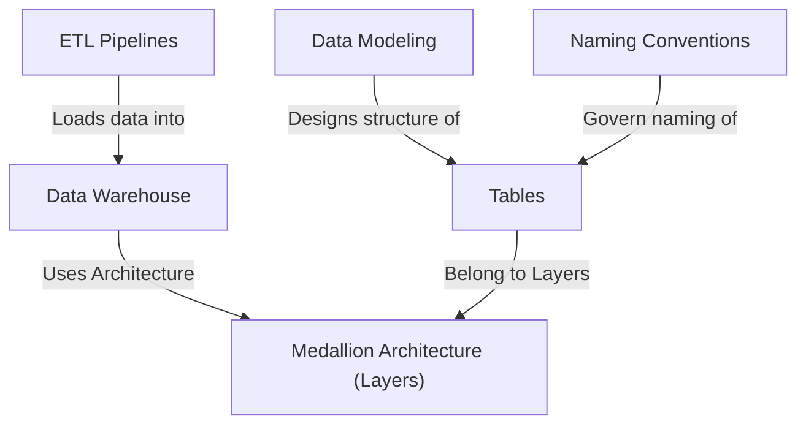

# Tutorial: Datawarehouse

This project is a **central library** (*Data Warehouse*) for a company's important information. It uses automated processes (*ETL Pipelines*) to bring in data from different places and organize it into distinct levels based on quality (*Medallion Architecture*). The data is carefully structured (*Data Modeling*) into easy-to-understand lists (*Tables*) following clear rules (*Naming Conventions*) so people can easily find and use it for reports and analysis.

## Visual Overview

## Chapters

1. [Data Warehouse
](01_data_warehouse_.md)
2. [ETL Pipelines
](02_etl_pipelines_.md)
3. [Medallion Architecture (Layers)
](03_medallion_architecture__layers__.md)
4. [Tables
](04_tables_.md)
5. [Data Modeling
](05_data_modeling_.md)
6. [Naming Conventions
](06_naming_conventions_.md)

---

Generated by [AI Codebase Knowledge Builder](https://github.com/The-Pocket/Tutorial-Codebase-Knowledge).
