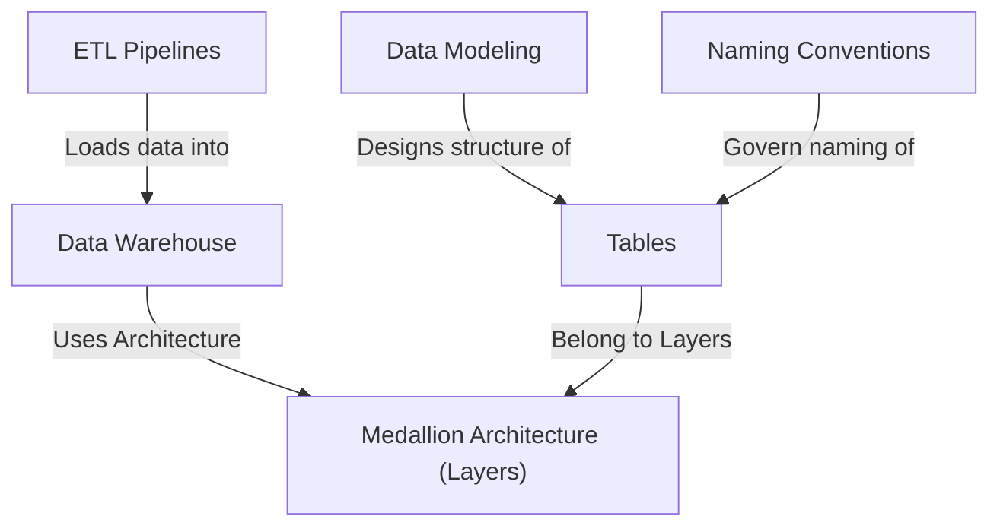
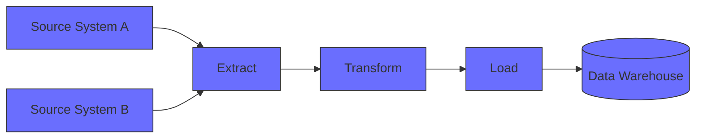
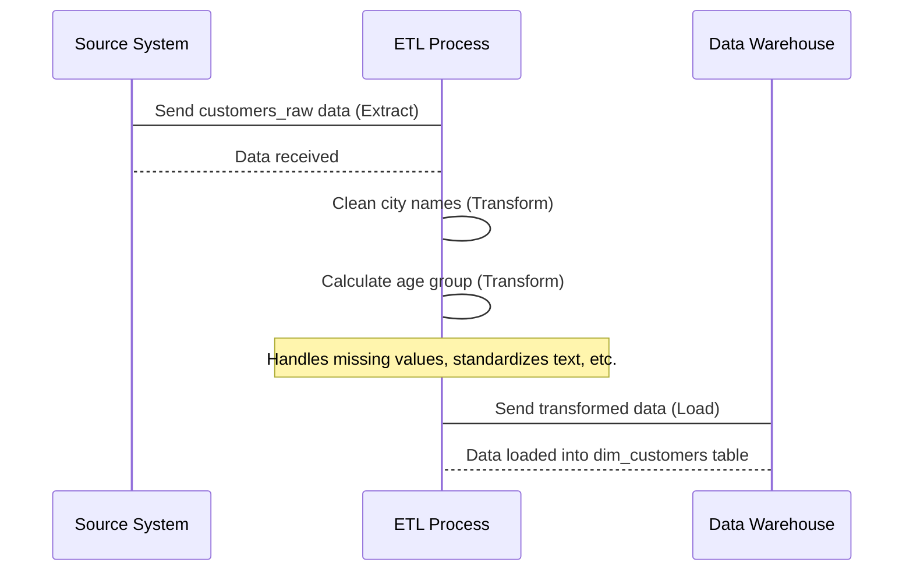
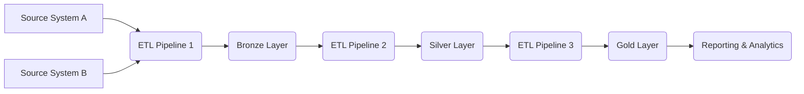
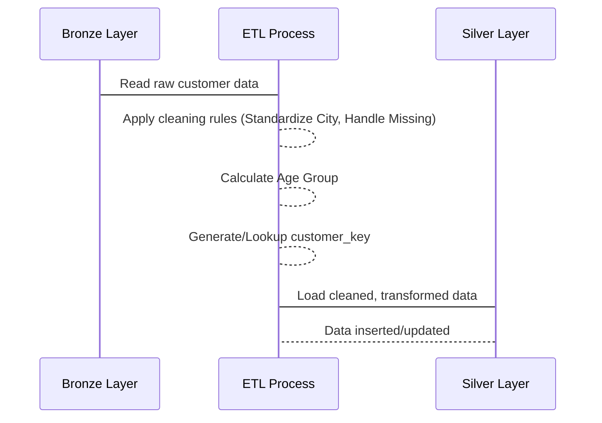
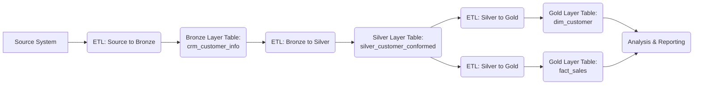
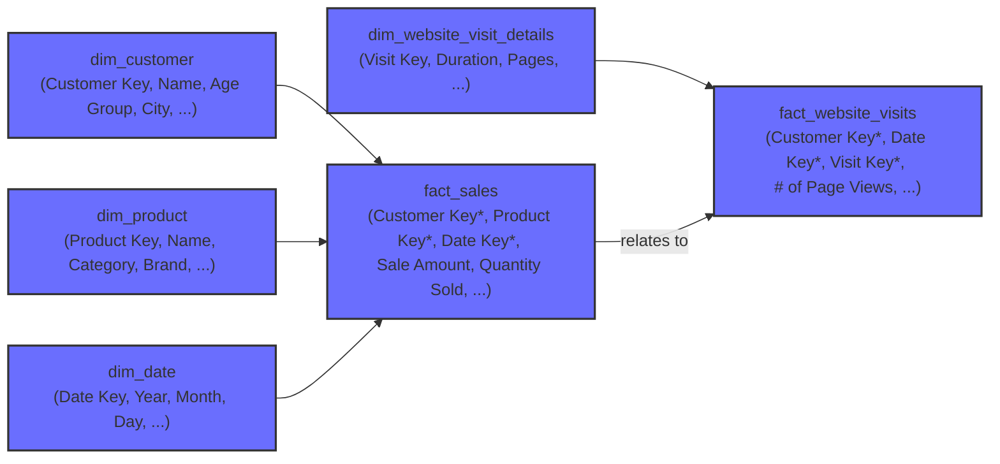
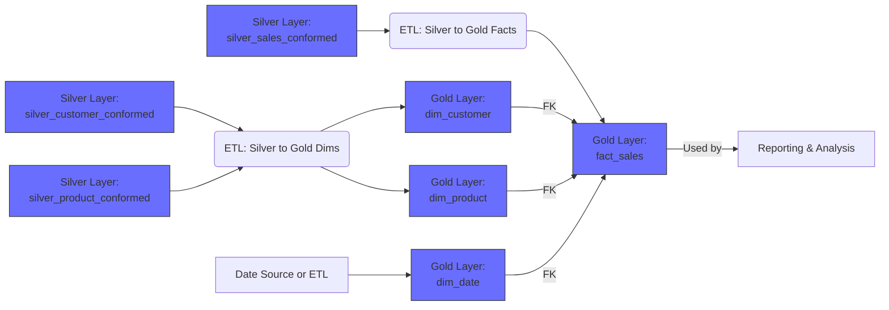

# Datawarehouse


This project is a **central library** (*Data Warehouse*) for a company's important information. It uses automated processes (*ETL Pipelines*) to bring in data from different places and organize it into distinct levels based on quality (*Medallion Architecture*). The data is carefully structured (*Data Modeling*) into easy-to-understand lists (*Tables*) following clear rules (*Naming Conventions*) so people can easily find and use it for reports and analysis.


## Visual Overview



## Chapters

1. [Data Warehouse
](data-warehouse)
2. [ETL Pipelines
](02_etl_pipelines_.md)
3. [Medallion Architecture (Layers)
](03_medallion_architecture__layers__.md)
4. [Tables
](04_tables_.md)
5. [Data Modeling
](05_data_modeling_.md)
6. [Naming Conventions
](06_naming_conventions_.md)

---


# Chapter 1: Data Warehouse

Welcome to the world of data warehouses! This is the very first step in understanding how we can bring together information from many different places to make smart decisions.

Imagine you run a company. You have information about your sales in one system, details about your customers in another, and maybe website activity data in a third. Now, you want to answer a question like: "Which age group of customers who visited our website last month bought the most of Product X?"

Trying to answer this question by looking at each system separately is incredibly difficult! The data is in different formats, stored in different places, and it's hard to connect everything together. This is a common problem for many businesses.

## What is a Data Warehouse
?

This is where a **Data Warehouse** comes in. Think of it as a special, super-organized library for all your company's important information. Instead of books, it stores data.

Let's look at a simple definition:

A Data Warehouse is the central storage system designed to bring together large amounts of data from different sources. Think of it as a comprehensive library for all of a company's important business information. The data is cleaned, organized, and structured here so it can be easily analyzed to help people understand business performance and make decisions.

Let's break that down:

1.  **Central Storage System:** It's one main place where data goes.
2.  **Bring together data from different sources:** It collects data from all those separate systems (sales, customers, website, etc.).
3.  **Large amounts of data:** It's built to handle a lot of information, not just a little bit.
4.  **Data is cleaned, organized, and structured:** This is key! The data doesn't just get dumped in. It's tidied up, errors are corrected, and it's put into a format that makes sense for analysis. Like organizing books by genre, author, and subject in a library.
5.  **Easily analyzed:** Because the data is clean and organized, it becomes much easier and faster to look for patterns, trends, and answers.
6.  **Help understand business performance and make decisions:** This is the ultimate goal! By analyzing the data, you gain insights that help you make better choices for your business.

Using our library analogy:
Imagine each separate system (sales, customers, website) is like a different room in a big building, each with books piled up randomly. A data warehouse is like taking all those books, bringing them to a central library building, sorting them, cataloging them, and putting them neatly on shelves. Now, finding a book (or a piece of information) is much simpler!

## How Does it Solve Our Problem?

Going back to our question: "Which age group of customers who visited our website last month bought the most of Product X?"

Without a data warehouse, you'd struggle. With a data warehouse:
1.  Data from your sales system, customer system, and website system are all loaded into the data warehouse.
2.  This data is **cleaned** (e.g., fixing typos in customer names or standardizing product names) and **organized** (e.g., making sure dates are in the same format).
3.  It's then **structured** in a way that you can easily link sales records to the specific customer who made the purchase and see if that customer also had a website visit recorded.
4.  Now, you can use analysis tools or simply write queries (questions for the database) to find the customers who bought Product X, see their age group (from the customer data), and check if they visited the website last month. All this information is now together and easy to query!

## What's Next?

A data warehouse is the destination, the place where the data lives in an organized way. But how does the data get *into* the data warehouse in the first place? And how do we ensure it's clean and structured correctly?

That process involves several steps and concepts that we will explore in the following chapters. We'll talk about the steps needed to Extract, Transform, and Load data ([ETL Pipelines](02_etl_pipelines_.md)), how we might organize the data inside the warehouse into different layers ([Medallion Architecture (Layers)](03_medallion_architecture__layers__.md)), how the data is physically stored ([Tables](04_tables_.md)), the blueprint for organizing data for analysis ([Data Modeling](05_data_modeling_.md)), and consistent rules for naming things ([Naming Conventions](06_naming_conventions_.md)).

In summary, a data warehouse is a powerful central hub that makes it possible to combine, clean, and analyze data from across your business to gain valuable insights and make informed decisions.

Ready to learn how data actually gets into this organized "library"? Let's move on!


---


# Chapter 2: ETL Pipelines

Welcome back! In [Chapter 1: Data Warehouse](01_data_warehouse_.md), we learned that a data warehouse is our central, organized library for important business data, designed to make analysis easy. We saw how it helps answer complex questions by bringing data together.

But how does all that scattered data from different source systems actually *get* into this organized library? How is it cleaned up and prepared for analysis?

Imagine you're a chef preparing a grand meal with ingredients coming from various markets. You don't just dump everything into the pot straight from the delivery truck! You need a process:

1.  You **gather** (Extract) ingredients from all the different markets.
2.  You **prepare** (Transform) the ingredients: wash the vegetables, chop them, maybe marinate the meat, mix spices according to your recipe.
3.  You **cook and serve** (Load) the finished dish into the serving plates.

This is exactly what happens with data when it goes into a data warehouse! This process is handled by something called an **ETL Pipeline**.

## What is an ETL Pipeline?

**ETL** stands for three main steps:

1.  **E**xtract
2.  **T**ransform
3.  **L**oad

An ETL pipeline is essentially an automated series of steps or a workflow that performs these three actions in order. Its job is to take raw data from one or more sources, clean and reshape it, and then put it into the data warehouse.

Think of it as that automated assembly line we mentioned in the project description. Raw data goes in at one end, and clean, structured data comes out at the other, ready to be placed in the correct spot in our data library.

## The Three Steps: Extract, Transform, Load

Let's look at each step in a bit more detail:

### Step 1: Extract (Gathering the Ingredients)

This is the first step where the data is collected from its original homes. These homes could be databases from your sales system, spreadsheets with customer lists, logs from your website, or data from external services.

The goal here is simply to *get* the raw data out of the source system.

**What happens:**

*   Connecting to the source system (like logging into a database or opening a file).
*   Reading the required data.
*   Making a copy of that data so the transformation step can work on it without affecting the original source.

Imagine pulling the customer list from your CRM system and the sales transactions from your ERP system.

### Step 2: Transform (Preparing According to the Recipe)

This is usually the most complex and important step. The data you extracted is often messy, incomplete, or in the wrong format. The transformation step cleans, combines, restructures, and prepares the data according to the rules needed for your data warehouse and for analysis.

**What happens:**

*   **Cleaning Data:** Fixing errors, handling missing values (e.g., filling in blank addresses or removing records with no customer ID), standardizing formats (e.g., making sure all dates look the same, ensuring 'California' isn't sometimes 'CA').
*   **Combining Data:** Joining data from different sources (e.g., linking customer information with their sales orders).
*   **Aggregating Data:** Summarizing data (e.g., calculating the total sales per day or per customer).
*   **Calculating New Values:** Creating new pieces of information based on the raw data (e.g., calculating profit margin from sale price and cost, or determining a customer's age group based on their birth date).
*   **Restructuring Data:** Changing the layout of the data to fit the data model in your warehouse (more on [Data Modeling](05_data_modeling_.md) later!).

This is where you apply the "recipe" to turn raw ingredients into a prepared meal. For our analysis question ("Which age group..."), this step would involve linking sales data to customer data, calculating age groups, and standardizing product names.

We often refer to how tables are named during this transformation process, following rules like those in [Naming Conventions](06_naming_conventions_.md).

### Step 3: Load (Serving the Meal)

In this final step, the transformed, clean data is moved into the data warehouse. The data is organized and stored in specific places, usually in [Tables](04_tables_.md), ready for people to access and analyze.

**What happens:**

*   Connecting to the data warehouse.
*   Writing the transformed data into the correct tables.
*   This could mean adding new records (like new sales) or updating existing ones (like a customer changing their address).

This is like placing the finished, cooked dishes onto the correct shelves or sections in our data library ([Tables](04_tables_.md)), organized according to our library's plan ([Data Modeling](05_data_modeling_.md)).

## ETL Pipeline Flow

Here's a simple visual representation of how an ETL pipeline works:



This diagram shows data flowing from different **Source Systems**, going through the **Extract**, **Transform**, and **Load** steps by an **ETL** process or tool, and finally arriving in the **Data Warehouse**.

## Connecting Back to Our Problem

How does ETL help us answer "Which age group of customers who visited our website last month bought the most of Product X?"

1.  **Extract:** The ETL pipeline extracts data from your sales system, your customer database, and your website logs.
2.  **Transform:** The pipeline cleans this data, links sales records to customers, calculates age groups, standardizes product names, and potentially filters website visits to the last month. It gets the data ready so that all the necessary pieces of information (sale, customer age, website visit) can be connected.
3.  **Load:** The clean, connected data is loaded into the data warehouse into specific tables designed for analysis (following your [Data Modeling](05_data_modeling_.md) plan).

Now, because the ETL pipeline has done the hard work of bringing the relevant data together and cleaning it, analyzing it becomes much easier! You can query the organized data in the warehouse directly.

## Inside the Pipeline (Conceptual Walkthrough)

Let's imagine a very simple ETL process for loading some customer data.

We have a source system with a table like this:

**Source System: `customers_raw` table**

| cust\_id | customer\_name | customer\_city | date\_of\_birth |
| :------- | :------------- | :------------- | :-------------- |
| 101      | Alice Smith    | New York       | 1990-05-15      |
| 102      | Bob Johnson    | LA             | 1985-11-20      |
| 103      | Charlie Brown  | London         | 2000-01-30      |
| 104      | David Williams | new york       | 1975-07-01      |
| 105      | Eve Adams      |                | 1998-03-10      |

Notice the data isn't perfect: 'LA' vs 'New York' vs 'London', 'new york' lowercase, a missing city.

Here's a conceptual walkthrough of the ETL steps:



1.  **Extract:** The ETL process connects to the source and pulls the data from the `customers_raw` table. It now has a copy of the table above.
2.  **Transform:** The ETL process starts working on the copy:
    *   It standardizes city names: 'LA' becomes 'Los Angeles', 'new york' becomes 'New York'. It might handle the missing city for Eve (perhaps mark it as 'Unknown').
    *   It calculates the age group based on `date_of_birth` (e.g., '20s', '30s', '40s').
    *   It renames `cust_id` to `customer_source_id` to indicate it's the ID from the source system (following [Naming Conventions](06_naming_conventions_.md)).
    *   It generates a new, unique `customer_key` for each customer, which will be the primary key in the data warehouse table ([Naming Conventions](06_naming_conventions_.md)).
3.  **Load:** The clean, transformed data is inserted into a table in the data warehouse, perhaps named `dim_customers` (following [Naming Conventions](06_naming_conventions_.md) and [Data Modeling](05_data_modeling_.md)).

**Data Warehouse: `dim_customers` table after loading**

| customer\_key | customer\_source\_id | customer\_name | customer\_city | age\_group | dwh\_load\_date |
| :------------ | :------------------- | :------------- | :------------- | :--------- | :-------------- |
| 1             | 101                  | Alice Smith    | New York       | 30s        | 2023-10-27      |
| 2             | 102                  | Bob Johnson    | Los Angeles    | 30s        | 2023-10-27      |
| 3             | 103                  | Charlie Brown  | London         | 20s        | 2023-10-27      |
| 4             | 104                  | David Williams | New York       | 40s        | 2023-10-27      |
| 5             | 105                  | Eve Adams      | Unknown        | 20s        | 2023-10-27      |

See how the data is now cleaner, more standardized, has new useful information (`age_group`, `customer_key`), and includes a technical column like `dwh_load_date` ([Naming Conventions](06_naming_conventions_.md)) added by the ETL process? This is the power of the transformation step!

## Conceptual Code Examples

Let's look at *very* simplified examples of what the code *inside* an ETL process *might* conceptually do for the customer example above. Real-world ETL code can be complex, using specialized tools or scripts, but the steps are the same.

**Extract (Getting the Data):**

Imagine the source is a SQL database. The ETL process might run a simple query:

```sql
-- Conceptual SQL for Extraction
SELECT
    cust_id,
    customer_name,
    customer_city,
    date_of_birth
FROM
    source_system.customers_raw;
```

*Explanation:* This SQL query selects the relevant columns from the original source table `customers_raw`. The ETL process takes the results of this query as input for the next step.

**Transform (Cleaning and Reshaping):**

This step involves logic to clean and enhance the data. It could be done using SQL, Python, or specialized ETL tools.

```sql
-- Conceptual SQL for Transformation (Partial)
SELECT
    cust_id AS customer_source_id, -- Rename column
    customer_name,
    CASE -- Standardize city names
        WHEN customer_city = 'LA' THEN 'Los Angeles'
        WHEN customer_city = 'new york' THEN 'New York'
        WHEN customer_city IS NULL OR customer_city = '' THEN 'Unknown'
        ELSE customer_city
    END AS customer_city,
    -- Add logic here to calculate age_group from date_of_birth
    -- Add logic here to generate a unique customer_key
    '2023-10-27' AS dwh_load_date -- Add technical column
FROM
    extracted_data; -- Data received from the Extract step
```

*Explanation:* This SQL query is processing the data extracted. It renames a column (`cust_id` to `customer_source_id`), uses a `CASE` statement to standardize city names, and conceptually includes places where you'd add logic for calculating age group, generating the unique key, and adding the load date. This produces the clean, transformed data ready for loading.

**Load (Putting Data in the Warehouse):**

Finally, the transformed data is loaded into the target table in the data warehouse.

```sql
-- Conceptual SQL for Loading
INSERT INTO data_warehouse.public.dim_customers ( -- Target table
    customer_key,
    customer_source_id,
    customer_name,
    customer_city,
    age_group,
    dwh_load_date
)
SELECT
    customer_key, -- Values generated in Transform
    customer_source_id,
    customer_name,
    customer_city,
    age_group,
    dwh_load_date
FROM
    transformed_data; -- Data from the Transform step
```

*Explanation:* This `INSERT` statement takes the rows from the `transformed_data` (the output of the previous step) and adds them into the `dim_customers` table in the data warehouse.

These are just conceptual examples. Real ETL tools automate much of this, providing visual interfaces or specialized code libraries, but the underlying **Extract, Transform, Load** process remains fundamental.

Some ETL pipelines might involve loading data into temporary or staging tables in the data warehouse *before* the final transformation and loading into the target tables. This is part of designing the internal organization or layers of the data warehouse, which brings us to our next topic.

## Conclusion

ETL pipelines are the engine that drives data into the data warehouse. They automate the crucial steps of getting data from various places (**Extract**), cleaning and preparing it according to business rules (**Transform**), and finally storing it in an organized way (**Load**). By doing this work upfront, ETL ensures the data in your data warehouse is reliable and ready for fast and easy analysis, helping you answer those important business questions.

Now that we understand how data gets *into* the data warehouse and is prepared, how do we organize the data *within* the warehouse itself? Is there a standard way to structure the different stages of transformed data? Yes, and that's what we'll explore in the next chapter.

[Next Chapter: Medallion Architecture (Layers)](03_medallion_architecture__layers__.md)

---


# Chapter 3: Medallion Architecture (Layers)

Welcome back! In [Chapter 1: Data Warehouse](01_data_warehouse_.md), we learned that a data warehouse is our central, organized library for business data. In [Chapter 2: ETL Pipelines](02_etl_pipelines_.md), we discovered how ETL (Extract, Transform, Load) is the process that brings raw data into the warehouse and starts cleaning and preparing it.

Now that the data is arriving, where does it go inside the warehouse? Do we just dump everything into one big pile? Or do we keep the raw data, the semi-cleaned data, and the fully ready-to-analyze data separate?

Imagine our data warehouse library again. When new books (raw data) arrive, they aren't immediately put on the main shelves. They might first go to a receiving area (extracted), then to a processing area where they are cataloged and repaired if needed (transformed), and finally placed on the correct shelves (loaded) in the main reading rooms.

In data warehousing, we use a similar idea to organize data based on how much it's been cleaned and transformed. This is where the **Medallion Architecture** comes in.

## What is Medallion Architecture?

The Medallion Architecture is a design pattern that structures data within the data warehouse (or a data lakehouse, a related concept) into distinct layers. These layers represent the stages of data transformation, from raw data to highly refined, business-ready data.

Think of it like refining precious metals. You start with raw ore, which is processed into ingots, and then finally crafted into valuable coins or jewelry. Each step adds value and changes the form of the material.

The Medallion Architecture typically uses three main layers:

1.  **Bronze Layer** (Raw Data)
2.  **Silver Layer** (Cleaned and Conformed Data)
3.  **Gold Layer** (Business-Ready, Optimized Data)

Let's explore each layer.

## The Layers: Bronze, Silver, Gold

### 1. Bronze Layer (The Raw Ore)

*   **Purpose:** This is the initial landing zone for data directly from the source systems.
*   **Characteristics:**
    *   Data is kept in its **original, raw format**. Minimal to no transformations are applied here.
    *   It includes all historical data from the source.
    *   It often contains messy, uncleaned, or inconsistent data just as it was received.
*   **Why have it?**
    *   **Traceability:** You always have the original source data available for auditing or debugging.
    *   **Resiliency:** If there's a mistake in a transformation step later on, you can easily re-process the original raw data from Bronze rather than going back to the source system.
    *   **Speed to Ingest:** You can land data quickly without complex transformation logic slowing things down.
*   **Analogy:** This is like the delivery truck dropping off all the raw ingredients (vegetables, meat, spices) from various markets into a receiving area. They aren't washed, chopped, or mixed yet.
*   **Naming Convention (Ref. [Naming Conventions](06_naming_conventions_.md)):** Tables here often follow a pattern like `<sourcesystem>_<entity>`, keeping the original source names. E.g., `crm_customer_info`, `erp_sales_orders`. You might add technical columns like `dwh_load_date` here (as mentioned in [Chapter 2: ETL Pipelines](02_etl_pipelines_.md) and [Naming Conventions](06_naming_conventions_.md)).

### 2. Silver Layer (The Refined Ingots)

*   **Purpose:** This layer contains data that has been cleaned, standardized, and integrated from the Bronze layer.
*   **Characteristics:**
    *   Data quality rules are applied (e.g., handling missing values, correcting data types, standardizing text like city names).
    *   Data from different sources is integrated and linked (e.g., linking sales records from ERP to customer information from CRM).
    *   Basic transformations and calculations might occur (like calculating age groups from birth dates, as seen in the Chapter 2 example).
    *   Data is often structured in a more organized way, perhaps starting to resemble a relational model.
*   **Why have it?**
    *   **Single Source of Truth:** Provides a consistent view of core business entities (like customers, products, locations) that is clean and reliable.
    *   **Reusable:** The cleaned and integrated data in Silver can be the source for multiple Gold layer tables or different analytical needs.
    *   **Improved Data Quality:** Makes the data much more reliable than the raw Bronze data.
*   **Analogy:** This is where the raw ingredients are washed, peeled, chopped, and prepared according to basic kitchen standards. They are ready to be used in various dishes but haven't been combined into a final meal yet.
*   **Naming Convention (Ref. [Naming Conventions](06_naming_conventions_.md)):** Tables here might still reference source systems but are cleaner. E.g., `crm_customer_info`, but the *data inside* is clean. Or they might start becoming more conformed like `conformed_customer`. They will likely have generated keys like `customer_key` ([Naming Conventions](06_naming_conventions_.md)).

### 3. Gold Layer (The Crafted Jewelry)

*   **Purpose:** This is the final layer, containing highly refined data optimized for specific business use cases, reporting, and analysis.
*   **Characteristics:**
    *   Data is often structured in a way that is easy for business users and analytical tools to query (e.g., using [Data Modeling](05_data_modeling_.md) patterns like Star Schemas with fact and dimension [Tables](04_tables_.md)).
    *   Includes aggregations and summary data (e.g., total sales per day, monthly active users).
    *   May involve denormalization for performance.
    *   This data directly feeds reports, dashboards, and advanced analytics.
*   **Why have it?**
    *   **Performance:** Optimized for fast query execution for analytical workloads.
    *   **Usability:** Data is structured and named in a way that aligns with business terms, making it easy for non-technical users to understand and use for reporting.
    *   **Business Focus:** Tailored to answer specific business questions and support particular reports.
*   **Analogy:** This is the final step where the prepared ingredients are combined, cooked, and plated into the final dishes, ready to be served and enjoyed. They are optimized for presentation and consumption.
*   **Naming Convention (Ref. [Naming Conventions](06_naming_conventions_.md)):** Tables here are typically named based on the business concept or the analytical model. E.g., `dim_customer`, `fact_sales`, `report_monthly_revenue`.

## How ETL Pipelines Fit with Medallion Architecture

In [Chapter 2: ETL Pipelines](02_etl_pipelines_.md), we saw how ETL moves data from sources *into* the data warehouse. With the Medallion Architecture, ETL pipelines are responsible for moving data *between* the layers as well.

You might have separate ETL processes or stages for each transition:

1.  **Source -> Bronze ETL:** Primarily **Extract** from source and **Load** into Bronze. Minimal **Transform** (maybe just adding technical metadata like load timestamp).
2.  **Bronze -> Silver ETL:** **Extract** from Bronze, apply significant **Transform** (cleaning, standardizing, integrating), and **Load** into Silver.
3.  **Silver -> Gold ETL:** **Extract** from Silver, apply **Transform** (aggregating, restructuring for analytics), and **Load** into Gold.

Here's a simple flow diagram illustrating this:



Each ETL pipeline in this diagram takes data from a source layer (or external source) and processes it before loading it into the next layer. This layered approach makes the overall data pipeline more modular, manageable, and robust.

## Connecting Back to Our Customer Example

Let's revisit the customer data example from Chapter 2 and see how it fits into the Medallion layers.

*   **Source Data:** The original, messy `customers_raw` table from the source system.
    *   *Fits in:* This is the data that *would* be extracted *to* the Bronze layer.
*   **Bronze Layer:** Contains the raw data exactly as it was extracted, maybe with an added `dwh_load_date`.
    *   *Example:* A table named `crm_customer_info_bronze` (or similar, depending on naming conventions) holding the exact data from the source system.
*   **Silver Layer:** Contains the cleaned and standardized customer data, where cities are corrected, missing values handled, and perhaps an `age_group` is calculated. This is the result of the transformation we discussed in Chapter 2. It also might have a unique `customer_key`.
    *   *Example:* A table named `silver_customer_conformed` or `crm_customer_info_silver` holding data like:
        ```
        customer_key | customer_source_id | customer_name | customer_city | age_group | dwh_load_date
        ------------ | ------------------ | ------------- | ------------- | --------- | -------------
        1            | 101                | Alice Smith   | New York      | 30s       | 2023-10-27
        2            | 102                | Bob Johnson   | Los Angeles   | 30s       | 2023-10-27
        ...          | ...                | ...           | ...           | ...       | ...
        ```
    *   This data is now a reliable source for anything needing customer details.
*   **Gold Layer:** Could contain aggregated customer data or be part of a larger analytical model (like a dimension table in a Star Schema).
    *   *Example 1 (Aggregation):* A simple table summarizing customers by age group and city for reporting.
        ```
        age_group | customer_city | customer_count
        --------- | ------------- | --------------
        20s       | London        | 1
        20s       | Unknown       | 1
        30s       | New York      | 2
        30s       | Los Angeles   | 1
        40s       | New York      | 1
        ```
        *   *Fits in:* This could be a `report_customer_summary` table in the Gold layer.
    *   *Example 2 (Dimension Table):* The Silver customer data might be loaded into a `dim_customer` table ([Data Modeling](05_data_modeling_.md), [Naming Conventions](06_naming_conventions_.md)) in the Gold layer, specifically designed to link with sales fact tables for analyzing sales by customer attributes.

The Medallion Architecture provides a clear path for data as it flows through the ETL process and becomes more refined and valuable for analysis.

## Conceptual Process: Bronze to Silver ETL

Let's think about the ETL process that moves data from Bronze to Silver using our customer example.



1.  **Extract (from Bronze):** The ETL process reads the data from the `crm_customer_info_bronze` table.
    *   Conceptual SQL: `SELECT * FROM bronze.crm_customer_info_bronze;` (Very simple read)
2.  **Transform:** The ETL process takes this raw data and applies logic:
    *   Standardize `customer_city` (e.g., mapping 'LA' to 'Los Angeles', handling 'new york', filling missing values).
    *   Calculate `age_group` based on `date_of_birth`.
    *   Generate or look up a unique `customer_key` to use as the primary identifier in the Silver layer and beyond.
3.  **Load (into Silver):** The resulting clean, transformed data rows are written into the `silver_customer_conformed` table. This might involve inserting new rows or updating existing ones if the source data changes.
    *   Conceptual SQL (simplified): `INSERT INTO silver.silver_customer_conformed (...) SELECT transformed_columns FROM transformed_data;`

This process takes the raw, potentially messy data from Bronze and produces a clean, reliable version in Silver, ready for building reports or further transformation into Gold.

## Key Characteristics Summary

Here's a table summarizing the layers:

| Characteristic       | Bronze Layer                 | Silver Layer                         | Gold Layer                           |
| :------------------- | :--------------------------- | :----------------------------------- | :----------------------------------- |
| **Data State**       | Raw, untouched               | Cleaned, standardized, integrated    | Business-ready, aggregated, optimized |
| **Transformations**  | Minimal (e.g., load date)    | Cleaning, standardizing, integrating | Aggregations, restructuring, denorm |
| **Data Quality**     | As is from source            | Improved, reliable                   | High quality, validated              |
| **Primary Users**    | Data Engineers (for reprocessing/debugging) | Data Engineers, Data Scientists, Analysts (for exploration) | Business Users, Analysts (for reporting/BI) |
| **Flexibility**      | High (reprocess any rule)    | Moderate                             | Lower (specific for use case)        |
| **Storage Cost**     | Often higher (stores everything) | Moderate                             | Lower (summarized, fewer rows)       |
| **Query Performance**| Lower (raw, complex)         | Moderate                             | High (optimized for read)            |
| **Naming (Example)** | `erp_sales_raw`              | `silver_sales_conformed`             | `fact_sales`, `dim_product`          |

The Medallion Architecture provides a robust framework for managing data evolution within your data warehouse, ensuring data quality and providing optimized layers for different users and purposes.

## Conclusion

The Medallion Architecture, with its Bronze, Silver, and Gold layers, gives us a clear strategy for organizing data within the data warehouse based on its level of cleanliness and transformation. It moves data from a raw state (Bronze) through cleaning and integration (Silver) to a final, business-ready format optimized for analysis (Gold). This layered approach makes our data pipeline more organized, resilient, and efficient.

Now that we understand *how* data is layered, let's dive into the fundamental building blocks within these layers: the [Tables](04_tables_.md).

[Next Chapter: Tables](04_tables_.md)

---


# Chapter 4: Tables

Welcome back, data explorer!

In our previous chapters, we learned that a [Data Warehouse](01_data_warehouse_.md) is our central data library. We saw how [ETL Pipelines](02_etl_pipelines_.md) are the processes that gather, clean, and move data into the warehouse. We also learned that we organize the data *within* the warehouse using the [Medallion Architecture (Layers)](03_medallion_architecture__layers__.md) (Bronze for raw data, Silver for cleaned data, Gold for business-ready data).

Now, let's talk about the fundamental structures where the data actually *lives* inside this organized library and within these layers. Think of these structures as the specific shelves, sections, and filing cabinets where the books (our data) are neatly placed. These are called **Tables**.

## What are Tables?

At its core, a **Table** in a data warehouse (or any database) is a collection of data organized into **rows** and **columns**.

If you've ever used a spreadsheet program like Excel or Google Sheets, you're already familiar with the basic idea!

*   **Columns:** Represent different categories of information. In a spreadsheet, these are usually the headers at the top (like "Customer Name", "City", "Sale Amount"). In database language, these are often called **fields** or **attributes**.
*   **Rows:** Represent individual records or entries. In a spreadsheet, these are each numbered line (like one specific customer's details, or one specific sale transaction). In database language, these are often called **records** or **tuples**.

So, a table is essentially a structured grid designed to hold specific types of data.

Imagine a table storing customer information. It might have columns like `customer_id`, `customer_name`, `city`, and `date_of_birth`. Each row in that table would then contain the details for a single customer.

## Tables in the Medallion Architecture Layers

We learned about the Bronze, Silver, and Gold layers in [Chapter 3: Medallion Architecture (Layers)](03_medallion_architecture__layers__.md). Tables are the physical structures that hold the data *within* each of these layers. The same data might exist in tables in different layers, but in different states of transformation.

Let's look at how tables are used in each layer:

### Bronze Layer Tables (The Raw Shelves)

*   These tables store the data exactly as it was extracted from the source systems.
*   They typically have the same columns and data structure as the original tables in the source system.
*   Their purpose is to provide a raw, historical copy of the source data.
*   You might add a technical column here, like `dwh_load_date` (referencing [Naming Conventions](06_naming_conventions_.md)) to track when the data was loaded, but minimal other transformations occur.
*   Example Table Name (following [Naming Conventions](06_naming_conventions_.md)): `crm_customer_info` (raw customer data from the CRM system).

### Silver Layer Tables (The Cleaned & Organized Shelves)

*   These tables store data that has been cleaned, standardized, and potentially integrated from one or more Bronze tables.
*   Columns might be renamed, data types corrected, missing values handled, and data combined from different sources.
*   This layer provides a reliable, single source of truth for core business entities like customers, products, or locations.
*   These tables often include generated keys (like `customer_key` from [Naming Conventions](06_naming_conventions_.md)) to uniquely identify rows, which are crucial for linking data later ([Data Modeling](05_data_modeling_.md)).
*   Example Table Name (following [Naming Conventions](06_naming_conventions_.md)): `crm_customer_info` (same name as bronze, but *data inside* is clean) or perhaps `silver_customer_conformed`.

### Gold Layer Tables (The Ready-for-Analysis Sections)

*   These tables store data that is highly refined, aggregated, and structured specifically for reporting and analysis.
*   They are built from Silver layer tables and often follow specific [Data Modeling](05_data_modeling_.md) patterns like fact and dimension tables.
*   Data here is optimized for fast querying by reporting tools and business users.
*   Example Table Names (following [Naming Conventions](06_naming_conventions_.md)):
    *   `dim_customer` (a dimension table for customer attributes, built from Silver customer data).
    *   `fact_sales` (a fact table storing sales events and linking to dimensions like `dim_customer`, `dim_product`, `dim_date`).

Here's how tables conceptually fit into the layered flow:


This diagram shows how ETL pipelines take data from one layer's table(s) and transform it to load into table(s) in the next layer, making the data increasingly ready for analysis in the Gold layer.

## Creating and Loading Tables (Conceptual)

Creating a table means defining its structure: what columns it will have and what type of data each column will hold (like text, numbers, dates, etc.). Loading a table means putting the actual data (the rows) into that structure.

This is typically done as part of the ETL process.

Let's look at a simplified, conceptual SQL example for creating and loading a Silver layer customer table from a Bronze one.

First, creating the table structure (defining the columns):

```sql
-- Conceptual SQL to CREATE a Silver Customer Table
CREATE TABLE silver_customer_conformed (
    customer_key INT PRIMARY KEY, -- Unique ID for this table
    customer_source_id VARCHAR(50), -- Original ID from source
    customer_name VARCHAR(100),
    customer_city VARCHAR(100),
    age_group VARCHAR(10),
    dwh_load_date DATE -- When this row was loaded
);
```
*Explanation:* This code tells the database to create a table named `silver_customer_conformed`. We define the name of each column (`customer_key`, `customer_source_id`, etc.) and its data type (`INT` for integer, `VARCHAR` for text, `DATE` for date). `PRIMARY KEY` means `customer_key` will uniquely identify each row.

Next, loading data into the table (this happens during the ETL 'Load' step, after 'Extract' from Bronze and 'Transform'):

```sql
-- Conceptual SQL to INSERT data into the Silver Customer Table
INSERT INTO silver_customer_conformed (
    customer_key, customer_source_id, customer_name,
    customer_city, age_group, dwh_load_date
)
SELECT -- Selecting and transforming data from the Bronze source table
    generated_customer_key, -- Value calculated in Transform step
    cust_id,
    customer_name,
    standardized_city, -- Value calculated in Transform step
    calculated_age_group, -- Value calculated in Transform step
    CURRENT_DATE -- Today's date
FROM
    bronze.crm_customer_info; -- Reading from the Bronze table
```
*Explanation:* This `INSERT` statement takes data produced by the ETL's Transform step (which read from the Bronze table) and puts it into the newly created `silver_customer_conformed` table. The `SELECT` part conceptually represents the cleaned and transformed data ready to be loaded.

These examples use SQL, which is the standard language for interacting with relational databases where data warehouse tables often live. While actual ETL tools automate much of this, understanding the underlying table structure and loading process is key.

## Naming Your Tables

As we briefly touched upon, following clear [Naming Conventions](06_naming_conventions_.md) for your tables is crucial. It helps everyone understand what data a table contains and its purpose within the data warehouse layers.

Referencing our naming convention document ([Docs/naming_conventions.md](Docs/naming_conventions.md)), we saw examples:

*   **Bronze:** Start with source system + source name (e.g., `crm_customer_info`).
*   **Silver:** Can be similar to Bronze or indicate a conformed state (e.g., `crm_customer_info` or `silver_customer_conformed`).
*   **Gold:** Start with a category prefix indicating its role in the analytical model (e.g., `dim_` for dimension, `fact_` for fact, `report_` for reports). Examples: `dim_customers`, `fact_sales`.

Using these conventions makes your data warehouse much more organized and easier for others (and yourself!) to navigate.

## Using Tables for Analysis

Once the data has gone through the ETL pipeline and been loaded into the organized tables in the Gold layer (especially fact and dimension tables following [Data Modeling](05_data_modeling_.md) principles), it's ready for analysis.

Analysts and business users interact directly with these Gold layer tables using query tools. For example, to find the total sales amount from the `fact_sales` table:

```sql
-- Conceptual SQL to query a Gold Layer table
SELECT SUM(sale_amount) AS total_sales
FROM gold.fact_sales;
```
*Explanation:* This simple query selects the `sale_amount` column from the `fact_sales` table in the `gold` layer and calculates the sum of all values, giving you the total sales number.

To answer our original question ("Which age group of customers who visited our website last month bought the most of Product X?"), you would write a more complex query that joins (links) the `fact_sales` table with tables like `dim_customer` (to get age group) and potentially a website visit table (if that's also in Gold), and then group the results by age group. The tables make it *possible* to connect all these pieces of information.

## Conclusion

Tables are the fundamental building blocks within a data warehouse. They are structured grids of rows and columns that physically store the data. Tables exist within each layer of the [Medallion Architecture (Layers)](03_medallion_architecture__layers__.md), representing the data in its raw, cleaned, and business-ready states. [ETL Pipelines](02_etl_pipelines_.md) are responsible for moving and transforming data between these tables. Following clear [Naming Conventions](06_naming_conventions_.md) for tables keeps the warehouse organized. Ultimately, the well-structured tables in the Gold layer are what users query to gain insights and make decisions.

Now that we know data lives in tables, how do we decide *what* tables to create in the Silver and especially the Gold layers, and how should they be structured and related to make analysis efficient? That's where [Data Modeling](05_data_modeling_.md) comes in.

[Next Chapter: Data Modeling](05_data_modeling_.md)

---


# Chapter 5: Data Modeling

Welcome back! In our last few chapters, we've learned that a [Data Warehouse](01_data_warehouse_.md) is our organized data library, and [ETL Pipelines](02_etl_pipelines_.md) are the processes that bring data in and clean it, organizing it into layers using the [Medallion Architecture (Layers)](03_medallion_architecture__layers__.md) (Bronze, Silver, Gold). We also saw that the data itself is stored physically within these layers in [Tables](04_tables_.md).

So, we have data, it's clean (in the Silver layer), and it's ready to be put into the final layer, the Gold layer, which is designed specifically for analysis. But how do we structure the [Tables](04_tables_.md) in that Gold layer? Do we just make a giant table with everything in it? Or do we keep things separate? And how do we make sure the data is easy for analysis tools and business users to query?

This is where **Data Modeling** comes in.

## What is Data Modeling?

Think of Data Modeling as creating the **blueprint** or the **map** for your data in the Gold layer. It's the process of deciding *how* to structure your [Tables](04_tables_.md) and *how* they should relate to each other so that you can easily and efficiently answer business questions.

The main goal of data modeling in a data warehouse is to make data **easy and fast for analysis**. Unlike databases designed for recording transactions (like placing an order online), data warehouse databases are designed for reading and summarizing data across many records (like analyzing *all* orders placed last month).

The most common and powerful approach to data modeling for analysis in data warehouses is called **Dimensional Modeling**. It uses two main types of tables:

1.  **Dimension Tables:** Describe *things* (who, what, where, when).
2.  **Fact Tables:** Record *events* or *measurements*.

Let's go back to our motivating question: "Which age group of customers who visited our website last month bought the most of Product X?"

To answer this, we need information about:
*   The **sales event** itself (the purchase happened) - This is a measurement/event.
*   The **customer** who made the purchase (who) - This is a *thing* that describes the event.
*   The **product** that was bought (what) - This is another *thing* that describes the event.
*   The **date**/time of the sale (when) - Another *thing* describing the event.
*   Whether they **visited the website** last month (could be another event or attribute) - Another piece of information needed.

Dimensional modeling helps us organize these pieces of information into those two types of tables.

## The Two Pillars: Dimensions and Facts

### 1. Dimension Tables (The Descriptive Details)

*   **Purpose:** Dimension tables hold descriptive attributes about the data. They answer the "who, what, where, when, how" questions about your business.
*   **Content:** They contain details about entities like:
    *   **Customers:** Name, address, age group, gender, etc.
    *   **Products:** Name, category, brand, size, color, etc.
    *   **Dates:** Year, month, day, day of week, holiday flag, etc.
    *   **Locations:** City, state, country, store name, etc.
*   **Structure:** Each row in a dimension table represents a unique instance of that *thing* (a unique customer, a unique product).
*   **Keys:** Every dimension table has a unique identifier column, often called a **Surrogate Key** ([Naming Conventions](06_naming_conventions_.md)). This key is usually a simple integer (like 1, 2, 3...) and is used to link this dimension table to the fact tables. Following our [Naming Conventions](06_naming_conventions_.md), this key typically ends with `_key` (e.g., `customer_key`, `product_key`).

**Analogy:** In our data library, dimension tables are like the **catalog cards** or **descriptive labels** for the books. A card for "The Lord of the Rings" might have attributes like Title, Author, Genre, Publisher, Year Published.

### 2. Fact Tables (The Events and Measurements)

*   **Purpose:** Fact tables record business events or transactions and contain the numerical measurements associated with those events. They answer "how much" or "how many".
*   **Content:** They contain details about events like:
    *   **Sales:** Amount of the sale, quantity sold, profit.
    *   **Website Visits:** Number of pages viewed, duration of visit.
    *   **Inventory:** Stock level changes, quantity moved.
*   **Structure:** Each row in a fact table typically represents a single event or a specific period for a measurement (e.g., one sales transaction, one website visit).
*   **Keys:** Fact tables contain the **Surrogate Keys** from the related dimension tables. These keys are how the fact table links to the dimensions. A fact table doesn't have its own simple surrogate primary key in the same way a dimension does; its primary key is often a combination of the foreign keys linking to dimensions.
*   **Measurements:** Fact tables contain the actual numbers or metrics you want to analyze (e.g., `sale_amount`, `quantity`).

**Analogy:** In our data library, fact tables are like the **borrowing records** or **sales receipts**. A borrowing record might include the Date Borrowed, the Reader's ID, and the Book's ID. The Book ID and Reader ID link this record back to the descriptive details in the Book (Product Dimension) and Reader (Customer Dimension) catalog cards. The "measurement" might be how many books were borrowed that day.

## Putting it Together: The Star Schema

The most common design pattern using dimensions and facts is called the **Star Schema**. It's named this because the diagram looks like a star: a central **fact table** surrounded by several connected **dimension tables**.


*(Note: In a real Star Schema, the links go *from* the dimension table *to* the fact table, showing the fact table using the dimension's key. The diagram above shows the relationships correctly.)*

In this diagram:
*   `fact_sales` is the central fact table. It records individual sales transactions.
*   It contains measurements like `Sale Amount` and `Quantity Sold`.
*   Crucially, it contains keys (`Customer Key`, `Product Key`, `Date Key`) that link to the corresponding dimension tables.
*   `dim_customer`, `dim_product`, and `dim_date` are dimension tables that provide descriptive details about the customer, product, and date involved in each sale event recorded in `fact_sales`.
*   We could also have a `fact_website_visits` table recording website visit events, linked to `dim_customer` and `dim_date`.

This structure is powerful because it separates the descriptive information (dimensions) from the event/measurement information (facts), but links them together via keys. This makes querying based on dimension attributes very efficient.

## How Data Modeling Helps Answer Our Question

Our question is: "Which age group of customers who visited our website last month bought the most of Product X?"

Using the Star Schema model shown above:
1.  We look at the `fact_sales` table to find all sales transactions.
2.  For each sale, we use the `Customer Key` to link to the `dim_customer` table and find the `Age Group` of the customer.
3.  We use the `Product Key` to link to the `dim_product` table and check if the product is "Product X".
4.  We use the `Date Key` to link to the `dim_date` table and check if the sale happened "last month".
5.  We would also need to check if that customer (`Customer Key`) had a visit recorded in the `fact_website_visits` table (linked to `dim_customer` and `dim_date` for last month).
6.  Finally, we sum up the `Sale Amount` (or `Quantity Sold`) from `fact_sales` for all transactions that meet these criteria and group the results by the customer's `Age Group`.

Because the tables are structured this way, tools and SQL queries can easily navigate these relationships using the keys and filter/aggregate the data efficiently.

## Conceptual Table Structures

Let's look at *very* simplified conceptual SQL for the table structures in the Gold layer, referencing [Tables](04_tables_.md) and [Naming Conventions](06_naming_conventions_.md). These tables would be created and loaded by ETL processes taking data from the Silver layer.

```sql
-- Conceptual SQL to CREATE a Gold Layer Dimension Table (dim_customer)
CREATE TABLE gold.dim_customer (
    customer_key INT PRIMARY KEY, -- Surrogate Key (Naming Convention)
    customer_source_id VARCHAR(50), -- Link back to source/silver if needed
    customer_name VARCHAR(100),
    customer_city VARCHAR(100),
    age_group VARCHAR(10), -- Attribute derived in Silver/ETL
    -- ... other customer attributes
    dwh_load_date DATE -- Technical Column (Naming Convention)
);
```
*Explanation:* This creates the `dim_customer` table. `customer_key` is the unique ID. Other columns hold descriptive attributes. `age_group` comes from the transformation done in the Silver layer ETL.

```sql
-- Conceptual SQL to CREATE a Gold Layer Dimension Table (dim_product)
CREATE TABLE gold.dim_product (
    product_key INT PRIMARY KEY, -- Surrogate Key
    product_source_id VARCHAR(50),
    product_name VARCHAR(100),
    product_category VARCHAR(50),
    product_brand VARCHAR(50),
    -- ... other product attributes
    dwh_load_date DATE
);
```
*Explanation:* Similar structure for the `dim_product` table, holding details about products.

```sql
-- Conceptual SQL to CREATE a Gold Layer Dimension Table (dim_date)
CREATE TABLE gold.dim_date (
    date_key INT PRIMARY KEY, -- Surrogate Key (often YYYYMMDD)
    full_date DATE,
    day_of_month INT,
    month INT,
    month_name VARCHAR(20),
    year INT,
    day_of_week INT,
    day_name VARCHAR(20),
    -- ... other date attributes (e.g., is_holiday, is_weekend)
    dwh_load_date DATE
);
```
*Explanation:* A `dim_date` table is very common and useful. The `date_key` is often the date itself formatted as an integer (like 20231027). This table is usually populated once with all relevant dates.

```sql
-- Conceptual SQL to CREATE a Gold Layer Fact Table (fact_sales)
CREATE TABLE gold.fact_sales (
    -- No simple primary key here; it's often a composite of the foreign keys
    customer_key INT, -- Foreign Key linking to dim_customer
    product_key INT, -- Foreign Key linking to dim_product
    date_key INT, -- Foreign Key linking to dim_date
    -- Add other foreign keys to relevant dimensions (e.g., location_key)

    sale_amount DECIMAL(18, 2), -- Measurement
    quantity_sold INT, -- Measurement
    -- ... other measurements (e.g., profit)

    dwh_load_date DATE -- Technical Column
);
```
*Explanation:* This creates the `fact_sales` table. It contains the *keys* from the dimensions it relates to (`customer_key`, `product_key`, `date_key`) and the numerical `measurements` (`sale_amount`, `quantity_sold`) for each sales event.

## Data Modeling and the ETL Pipeline / Medallion Architecture

Data modeling defines the *target structure* for the Gold layer. The ETL pipelines ([Chapter 2: ETL Pipelines](02_etl_pipelines_.md)), specifically the ones moving data from Silver to Gold within the [Medallion Architecture (Layers)](03_medallion_architecture__layers__.md), are responsible for building and loading these dimension and fact tables.


*Explanation:* ETL processes read cleaned data from Silver layer tables. One type of ETL process builds the dimension tables in Gold. Another type builds the fact tables in Gold. The fact table ETL is crucial because it needs to look up the correct `_key` from the dimension tables for each event record before loading the data.

For example, when loading a sales transaction into `fact_sales`, the ETL process takes the raw customer ID from the Silver sales data, finds the corresponding `customer_key` in the `dim_customer` table, and inserts that `customer_key` into the `fact_sales` row.

## Importance of Naming Conventions in Data Modeling

As you can see from the conceptual table structures, following [Naming Conventions](06_naming_conventions_.md) is absolutely critical in data modeling. Prefixes like `dim_` and `fact_` immediately tell you the table's role. Suffixes like `_key` clearly identify the columns used to link tables. This makes the data model much easier for anyone to understand and use.

## Conclusion

Data Modeling is the essential step of designing the structure of your Gold layer [Tables](04_tables_.md) to make data analysis efficient. By organizing data into descriptive **Dimension Tables** and event/measurement **Fact Tables**, typically using a **Star Schema** pattern, you create a clear, navigable blueprint. This blueprint allows analysts and reporting tools to quickly find and aggregate the information needed to answer complex business questions like the one we discussed. The ETL processes ([ETL Pipelines](02_etl_pipelines_.md)) are what build and populate these modeled tables, taking cleaned data from the Silver layer ([Medallion Architecture (Layers)](03_medallion_architecture__layers__.md)) and applying the structure defined by the data model. Following clear [Naming Conventions](06_naming_conventions_.md) is key to making your data model understandable.

Now that we know how to structure our data with Data Modeling, let's take a closer look at those crucial rules for naming things that we've referenced multiple times – [Naming Conventions](06_naming_conventions_.md).

[Next Chapter: Naming Conventions](06_naming_conventions_.md)

---


# Chapter 6: Naming Conventions

Welcome back! In our journey through the data warehouse, we've learned that it's our organized data library ([Chapter 1: Data Warehouse](01_data_warehouse_.md)). We use [ETL Pipelines](02_etl_pipelines_.md) ([Chapter 2]) to fill it with data, organizing that data into layers ([Chapter 3: Medallion Architecture (Layers)](03_medallion_architecture__layers__.md)) of increasing cleanliness (Bronze, Silver, Gold). Inside these layers, the data lives in [Tables](04_tables_.md) ([Chapter 4]), structured by [Data Modeling](05_data_modeling_.md) ([Chapter 5]), especially in the Gold layer, to make analysis easy.

Throughout these chapters, you might have noticed we've been using specific ways to name our tables and columns – like `dim_customers`, `fact_sales`, `customer_key`, and `dwh_load_date`. Why is this important?

Imagine our data warehouse library is huge, with thousands of tables (like sections of books) and each table having dozens or hundreds of columns (like attributes of a book - author, title, ISBN, genre, publication date...). If everyone creating these tables and columns just used whatever names they felt like, finding the right data would be a nightmare! You wouldn't know if `customer_id` means the same thing in two different tables, or if `sales_amount` is total sale or just item price.

This is where **Naming Conventions** come in.

## What are Naming Conventions?

Naming Conventions are simply a set of agreed-upon rules for how to name things in your data warehouse. These rules apply to all the different objects you create, such as:

*   **Tables:** The containers for your data.
*   **Columns:** The specific fields within tables.
*   (Sometimes) **Other objects:** Like stored procedures or views.

Having consistent rules is like having a clear labeling system in our library. If all fiction books are in section "FIC", and all history books are in section "HIST", and within each section, books are organized by author's last name, it's much, much easier to find the book you're looking for.

In a data warehouse, consistent naming makes the "codebase" (all the table definitions, queries, and ETL scripts) much easier to read, understand, and maintain for everyone working with it. It saves time and prevents mistakes.

## Why Are They Important?

*   **Clarity:** Anyone looking at a table or column name immediately has an idea of what data it contains and its purpose.
*   **Consistency:** Reduces confusion. `customer_name` should always mean the same thing wherever you see it.
*   **Maintainability:** When you need to update or fix something, it's easier to find the relevant tables and columns.
*   **Collaboration:** Multiple people can work on the same data warehouse project without stepping on each other's toes or creating conflicting names.
*   **Tooling:** Many data analysis and visualization tools work better with consistently named data.

Our goal with naming conventions is simply to make the data warehouse user-friendly and reliable for everyone.

## Key Naming Rules

We'll follow the conventions documented in our project's `Docs/naming_conventions.md` file. Let's break down some of the key rules you've already seen in action in previous chapters.

### General Principles

These apply everywhere:

*   **`snake_case`:** Use lowercase letters and underscores (`_`) between words (e.g., `total_sale_amount`, not `TotalSaleAmount` or `totalSaleAmount`).
*   **English:** Use English words.
*   **Avoid Reserved Words:** Don't use words that have special meaning in SQL (like `SELECT`, `CREATE`, `TABLE`).

### Table Naming Conventions

Table names often reflect which layer of the [Medallion Architecture (Layers)](03_medallion_architecture__layers__.md) they belong to, and where the data came from or what it's used for ([Data Modeling](05_data_modeling_.md)).

Here's how we typically name tables in each layer, following the document:

*   **Bronze Layer Tables:**
    *   **Rule:** Start with the source system name, followed by the original table name from the source.
    *   **Pattern:** `<sourcesystem>_<entity>`
    *   **Example:** `crm_customer_info`
    *   **Explanation:** This tells us it's raw customer information from the CRM source system.

*   **Silver Layer Tables:**
    *   **Rule:** Similar to Bronze, starting with the source system name and original table name. The *difference* is in the *data inside* (it's cleaned), not necessarily the name itself according to this specific convention, although sometimes a `_silver` suffix is used in other conventions. Our document keeps the source naming for Silver for consistency, relying on layer/schema to differentiate.
    *   **Pattern:** `<sourcesystem>_<entity>`
    *   **Example:** `crm_customer_info` (The table is in the Silver layer schema, containing cleaned data from the Bronze `crm_customer_info`.)
    *   **Explanation:** This table in the Silver schema contains the *cleaned and standardized* customer data that originated from the CRM system. (Some conventions might name this differently, like `silver_crm_customer_info` or `conformed_customer`, but our documented rule keeps it simple).

*   **Gold Layer Tables:**
    *   **Rule:** Use meaningful business names, starting with a category prefix based on [Data Modeling](05_data_modeling_.md) principles.
    *   **Pattern:** `<category>_<entity>`
    *   **Examples:**
        *   `dim_customers`
        *   `fact_sales`
        *   `report_monthly_revenue`
    *   **Explanation:**
        *   `dim_` tells you it's a **dimension** table (describes a business *thing* like a customer).
        *   `fact_` tells you it's a **fact** table (records a business *event* or measurement like a sale).
        *   `report_` tells you it's a table specifically built to serve a particular **report**.
        *   The rest of the name (`customers`, `sales`, `monthly_revenue`) tells you the business topic.

### Column Naming Conventions

Specific rules make it easy to identify columns with special roles:

*   **Surrogate Keys:**
    *   **Rule:** Primary keys in dimension tables should end with `_key`.
    *   **Pattern:** `<table_name>_key`
    *   **Example:** `customer_key`
    *   **Explanation:** When you see `customer_key`, you immediately know this is the unique identifier used to link to the `dim_customers` table. As seen in [Data Modeling](05_data_modeling_.md), these keys are crucial for linking facts and dimensions.

*   **Technical Columns:**
    *   **Rule:** System-generated columns, like timestamps or load dates, start with `dwh_`.
    *   **Pattern:** `dwh_<column_name>`
    *   **Example:** `dwh_load_date`
    *   **Explanation:** This tells you the column contains metadata added by the data warehouse process itself, not original source data. We saw this mentioned in [ETL Pipelines](02_etl_pipelines_.md).

### Stored Procedure Naming

*   **Rule:** Stored procedures for loading data into layers follow a simple pattern.
*   **Pattern:** `load_<layer>`
*   **Examples:**
    *   `load_bronze`
    *   `load_silver`
    *   `load_gold`
*   **Explanation:** This clearly indicates the procedure's purpose and the layer it loads data into.

## How Naming Conventions Solve the Problem

Let's revisit our motivating example. Imagine walking into a data warehouse where tables and columns have consistent names based on these rules.

You need to analyze sales data. Where do you look? The `fact_sales` table in the Gold layer is a good starting point because the name clearly indicates it holds sales facts and is optimized for analysis.

You need customer details. Where do you look? The `dim_customers` table in the Gold layer. The `dim_` prefix tells you it's descriptive information about customers.

Inside `fact_sales`, you see columns like `customer_key`, `product_key`, `date_key`, `sale_amount`, `quantity_sold`, and `dwh_load_date`.
*   `customer_key`, `product_key`, `date_key` (ending in `_key`) tell you how to link this fact table to the `dim_customers`, `dim_products`, and `dim_date` tables to get descriptive details.
*   `sale_amount` and `quantity_sold` are clearly the measurements for the sale event.
*   `dwh_load_date` (starting with `dwh_`) tells you this column is about when the data arrived in the warehouse, not part of the original sale transaction data itself.

This consistent naming removes ambiguity and allows you (or your analysis tools) to quickly understand the data structure and write correct queries.

```sql
-- Example SQL query that is easy to read because of naming conventions
SELECT
    c.age_group, -- Age group from the customer dimension
    SUM(fs.sale_amount) AS total_sales -- Sum of sale amount from the fact table
FROM
    gold.fact_sales fs -- Alias for the fact sales table
JOIN
    gold.dim_customers c ON fs.customer_key = c.customer_key -- Join using the customer key
JOIN
    gold.dim_date d ON fs.date_key = d.date_key -- Join using the date key
WHERE
    d.year = 2023 AND d.month = 10 -- Filter for a specific month using date dimension attributes
GROUP BY
    c.age_group -- Group results by age group
ORDER BY
    total_sales DESC;
```
*Explanation:* Even without knowing the exact data, the names like `fact_sales`, `dim_customers`, `customer_key`, `sale_amount`, `age_group`, and `d.year`/`d.month` make it clear that this query is getting total sales summed up by customer age group for a specific date range, by joining the relevant fact and dimension tables using their respective `_key` columns. This is the power of consistent naming!

## Documenting Conventions

The most important part of having naming conventions is documenting them and making sure everyone working on the data warehouse follows them. Our project has a dedicated file for this: `Docs/naming_conventions.md`.

You can view the full set of rules there.

Let's look at a snippet from the documentation file (`Docs/naming_conventions.md`) to see how these rules are laid out:

```markdown
### **Gold Rules**
- All names must use meaningful, business-aligned names for tables, starting with the category prefix.
- **`<category>_<entity>`**
  - `<category>`: Describes the role of the table, such as `dim` (dimension) or `fact` (fact table).
  - `<entity>`: Descriptive name of the table, aligned with the business domain (e.g., `customers`, `products`, `sales`).
  - Examples:
    - `dim_customers` → Dimension table for customer data.
    - `fact_sales` → Fact table containing sales transactions.

#### **Glossary of Category Patterns**

| Pattern     | Meaning                           | Example(s)                              |
|-------------|-----------------------------------|-----------------------------------------|
| `dim_`      | Dimension table                  | `dim_customer`, `dim_product`           |
| `fact_`     | Fact table                       | `fact_sales`                            |
| `report_`   | Report table                     | `report_customers`, `report_sales_monthly`   |

### **Column Naming Conventions**

### **Surrogate Keys**
- All primary keys in dimension tables must use the suffix `_key`.
- **`<table_name>_key`**
  - `<table_name>`: Refers to the name of the table or entity the key belongs to.
  - `_key`: A suffix indicating that this column is a surrogate key.
  - Example: `customer_key` → Surrogate key in the `dim_customers` table.
```

*Explanation:* This snippet shows how the Gold layer table rules, including the `dim_` and `fact_` prefixes and the pattern, are formally documented. It also shows the rule for `_key` suffixes on surrogate keys, with examples. This document serves as the single source of truth for naming rules in this project.

Following this documented standard is key to making the data warehouse usable and maintainable over time.

## Conclusion

Naming conventions are a simple yet powerful tool in data warehousing. By applying consistent rules for naming tables, columns, and other objects – like using `snake_case`, prefixes for layers/types (`dim_`, `fact_`, `dwh_`), and suffixes for keys (`_key`) – you create a data warehouse that is easy to understand, navigate, and maintain. This clear labeling system, defined in a document like `Docs/naming_conventions.md`, is essential for collaboration and ensures that the valuable data you've collected and organized is easily accessible for analysis.

This concludes our introductory tutorial chapters for the `Datawarehouse` project. We've gone from understanding the core concept of a data warehouse ([Chapter 1]) and how data gets into it via [ETL Pipelines](02_etl_pipelines_.md) ([Chapter 2]), to organizing that data internally using the [Medallion Architecture (Layers)](03_medallion_architecture__layers__.md) ([Chapter 3]), storing it in [Tables](04_tables_.md) ([Chapter 4]), structuring those tables for analysis with [Data Modeling](05_data_modeling_.md) ([Chapter 5]), and finally, ensuring everything is clearly labeled with [Naming Conventions](06_naming_conventions_.md) (this chapter).

You now have a foundational understanding of the key concepts that make a data warehouse a powerful tool for business intelligence and decision-making!

---

